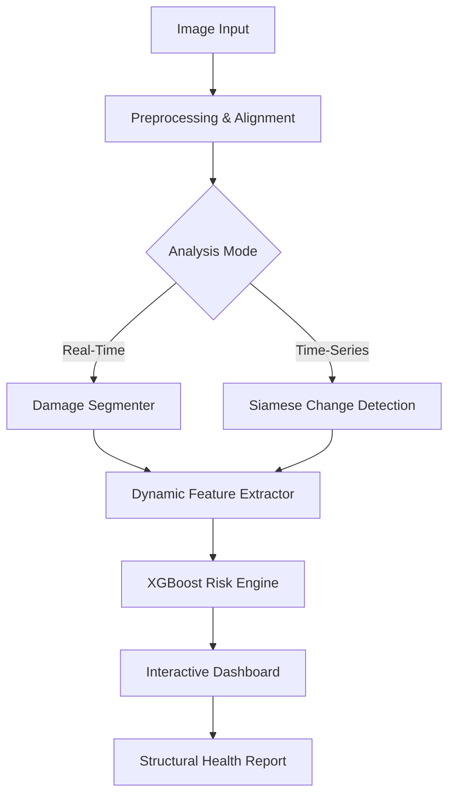

# 🏙️ InfraMind — AI-Powered Infrastructure Intelligence

[](https://www.python.org/)
[](https://pytorch.org/)
[](https://streamlit.io/)
[](LICENSE)

**InfraMind** is a state-of-the-art AI monitoring system designed to understand infrastructure health through multi-temporal visual analysis. It combines deep learning for damage segmentation with high-performance gradient boosting for structural risk prediction.

---

## 🌟 Vision & Purpose
Infrastructure is the backbone of society. InfraMind provides engineers and stakeholders with an **autonomous, visual-first auditing tool** that identifies cracks, analyzes structural depth, and predicts failure probability before it happens.

---

## ⚡ Core Modules

### 1. 🔍 Real-Time Structural Inspection
Equipped with a live ad-hoc inspection tab. Upload any image and receive:
- **High-Fidelity Segmentation Mask**: Pixel-perfect mapping of structural failure points.
- **JET Color-Mapped Heatmap**: Heat-based intensity overlay showing the severity of damage zones.
- **Structural Integrity Score (0-100)**: A dynamic, non-linear risk assessment that accounts for crack area, depth (intensity), and geometric complexity.

### 2. 🛰️ Multi-Temporal Change Detection
Uses a **Siamese U-Net Architecture** to compare "Before" and "After" imagery (drone/CCTV).
- **Difference Feature Fusion**: Isolates only the visual changes related to structural decay.
- **Growth Analysis**: Automatically calculates the growth rate of structural cracks over documented time periods.

### 3. 🧠 Dynamic Risk Predictor
An **XGBoost-powered Regression Engine** that analyzes 8 distinct structural features:
- **Geometric Complexity**: Fractal analysis of crack perimeters.
- **Damage Intensity**: Contrast-based depth approximation.
- **Deterioration Velocity**: Rate of change between documented inspection points.

---

## 🛠️ Technological Foundation

| Category | technologies |
| :--- | :--- |
| **Deep Learning** | PyTorch, torchvision, Segmentation Models Pytorch (SMP) |
| **Computer Vision** | OpenCV, Albumentations |
| **ML Engine** | XGBoost, Scikit-Learn |
| **Data Ops** | Pandas, NumPy, Joblib |
| **Front-End** | Streamlit, Plotly (Dynamic Graphing) |

---

## 🏗️ System Architecture



---

## 🚀 Quick Start

### 1. Clone & Environment
```bash
git clone https://github.com/darknecrocities/InfraMind.git
cd InfraMind
python3 -m venv venv
source venv/bin/activate
pip install -r requirements.txt
```

### 2. Dependency Note (macOS)
The high-performance XGBoost engine requires `libomp`:
```bash
brew install libomp
```

### 3. Launch the Intelligence Hub
```bash
streamlit run dashboard/app.py
```

---

## 📈 Dashboard Preview
The dashboard features an interactive location slider, time-lapse damage growth charts, and a real-time "Inspection Pro" tab for ad-hoc auditing.

---

## 👨‍💻 Developer
**Arron Kian Parejas**  
*AI Structural Monitoring System — Thesis-Level Research Project*

---
© 2026 InfraMind Intelligence. Designed for a safer tomorrow.
